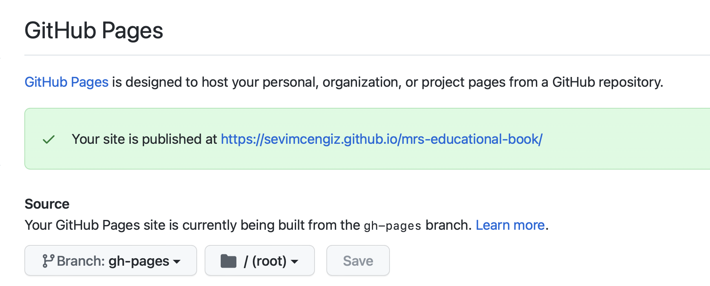

# mrs-educational-book

Steps:

You need to fork this repo. 


1. Clone repo

On the command line (Terminal)
```bash
git clone https://github.com/sevimcengiz/mrs-educational-book.git
```
2. Update contents and save
I used sublime text to update the "rmd" files.

3. Change directory 

Ex:  
```bash
cd /Users/sevim/Developer/mrs-educational-book
```

3. Commit changes into `main` branch

```bash
git add .
git commit -m "Update book contents"
```

4. Push changes to repo

```bash
git push -u origin main
```

After this part, it will automatically build and deploy. 
When you go tho the github pages;

```bash
https://github.com/sevimcengiz/mrs-educational-book/settings/pages
```

You will see this screen and when you check the link it will automatically updates the changes that you made. 

